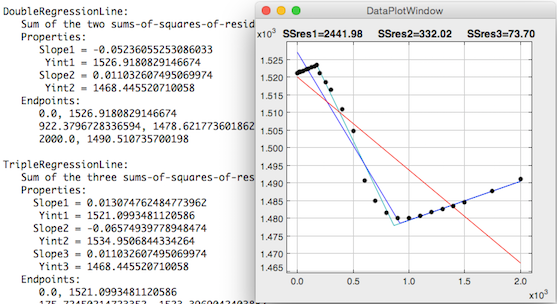

MultiRegressLines, 2002-2015  
Andy Ganse, Applied Physics Laboratory, University of Washington  
aganse@apl.washington.edu  

*Watch out, this version of the code still has some fundamental mathematical
problems - it's fun to play with but don't use it yet for serious analysis till
it's updated.  Meanwhile my Matlab code multiregresslines.matlab.tgz for this
problem (also on GitHub) is rigorous and accurate (but presently only does up
to two line segments).  The overall problem and its accurate description is
discussed on my webpage:
http://staff.washington.edu/aganse/mpregression/mpregression.html*

----------------------------------------------------------------
Dependencies:
* ptolemy.plot (PTPlot v2.0):
  http://ptolemy.eecs.berkeley.edu/java/ptolemy.plot2.0/ptolemy/plot/

* edu.washington.apl.aganse.ptolemyUpdates:
  https://github.com/aganse/ptolemyUpdates

* edu.washington.apl.aganse.dataTools:
  https://github.com/aganse/dataTools

----------------------------------------------------------------

MultiRegressLines runs 1-, 2-, and 3-line-segment regression
on a dataset of X,Y data.  Sometimes called "multi-phase linear
regression" in the literature, the idea is that N linear segments
are joined at their endpoints so that the procedure must estimate
not only N standard linear regressions but also the locations of
the join point(s).

The included, ready-made java program MultiRegressLines.jar 
runs at the command line, fits all three cases (1,2,3 segments)
to data pairs in a columnar ascii file, and plots the result.
Be sure to see the screenshot1.png and screenshot2.png files.

To run the MultiRegressLines application you will must install
the Java Runtime Environment (JRE), Java 2 version 1.4.0 or
higher, available from http://java.sun.com/getjava .

To run MultiRegressLines.jar, after Java is installed on your
system, from within the directory containing MultiRegressLines.jar
you can enter "java -jar MultiRegressLines.jar" at the commandline
to get a usage listing.  The program is entirely self contained
within that .jar file, so you can move it to whatever directory
you like (some common binary-executable directory for example).

To recompile all the routines and the MultiRegressLines.jar program
on a UNIX system, just type "make" at the commandline, and
everything will be recreated as intended.  On a Windows
system you'll need to look in the Makefile to note the
commandline arguments used in Javac and modify as appropriate for
Windows.  The graphical plotting routines, however, first require
the existence of the (free) PtPlot v2.0 from the Berkeley
Ptolemy project at http://ptolemy.eecs.berkeley.edu and the 
handful of APL updates to the files in ptolemy/plot made by me and
Pete Brodsky - these in edu/washington/apl/aganse/ptolemyUpdates.

Lastly, note that originally embedMultiRegressLines1.html and
embedMultiRegressLines2.html demonstrated two ways to embed the
applet into a webpage, but nowadays an accepted more cross-platform
way to do it is via Javascript, like e.g.:
http://stackoverflow.com/questions/4272666/embedding-java-applet-into-html-file

